<picture><source media="(prefers-color-scheme: dark)" srcset="assets/hero-dark.svg"></picture>

<a href="https://areeshaamir.dev/"><picture><source media="(prefers-color-scheme: dark)" srcset="assets/buttons/portfolio-dark.svg"></picture></a>
<a href="RESUME_URL"><picture><source media="(prefers-color-scheme: dark)" srcset="assets/buttons/resume-dark.svg"></picture></a>
<a href="mailto:EMAIL_ADDRESS"><picture><source media="(prefers-color-scheme: dark)" srcset="assets/buttons/email-dark.svg"></picture></a>
<a href="CALENDAR_URL"><picture><source media="(prefers-color-scheme: dark)" srcset="assets/buttons/call-dark.svg"></picture></a>
<a href="https://www.linkedin.com/in/areesha-amir/"><picture><source media="(prefers-color-scheme: dark)" srcset="assets/buttons/linkedin-dark.svg"></picture></a>

<picture><source media="(prefers-color-scheme: dark)" srcset="assets/stats-dark.svg"></picture>

I build AI products that keep working after launch day: assistants that show where their answers come from, automation that checks with a person before acting, and systems that stay affordable as they grow.

 

<picture><source media="(prefers-color-scheme: dark)" srcset="assets/sections/built-dark.svg"></picture>

<a href="LINK"><picture><source media="(prefers-color-scheme: dark)" srcset="assets/cards/answers-dark.svg"></picture></a>
<a href="LINK"><picture><source media="(prefers-color-scheme: dark)" srcset="assets/cards/automation-dark.svg"></picture></a>

<a href="LINK"><picture><source media="(prefers-color-scheme: dark)" srcset="assets/cards/quality-dark.svg"></picture></a>
<a href="LINK"><picture><source media="(prefers-color-scheme: dark)" srcset="assets/cards/cost-dark.svg"></picture></a>

16 more across 6 industries at <a href="https://areeshaamir.dev/">areeshaamir.dev</a>

<picture><source media="(prefers-color-scheme: dark)" srcset="assets/sections/work-dark.svg"></picture>

<picture><source media="(prefers-color-scheme: dark)" srcset="assets/steps-dark.svg"></picture>

<picture><source media="(prefers-color-scheme: dark)" srcset="assets/sections/skills-dark.svg"></picture>

<picture><source media="(prefers-color-scheme: dark)" srcset="assets/skills-dark.svg"></picture>

Python · TypeScript · React · FastAPI · PostgreSQL · Docker

<picture><source media="(prefers-color-scheme: dark)" srcset="assets/sections/journey-dark.svg"></picture>

<picture><source media="(prefers-color-scheme: dark)" srcset="assets/journey-dark.svg"></picture>

A full scholarship gave me four years to learn the fundamentals properly, and I spent them building for real people. Next, I want to work somewhere AI has to hold up in the real world, whether that's a research group, a graduate program, or a product team.

<picture><source media="(prefers-color-scheme: dark)" srcset="assets/sections/activity-dark.svg"></picture>

<picture>
  <source media="(prefers-color-scheme: dark)" srcset="https://github-readme-stats.vercel.app/api?username=AAreesha&count_private=true&include_all_commits=true&show_icons=true&hide_rank=true&hide_border=true&custom_title=GitHub&bg_color=0d1117&title_color=E8E4DC&text_color=8B9098&icon_color=86A7C8">
  
</picture>

<picture>
  <source media="(prefers-color-scheme: dark)" srcset="https://github-readme-activity-graph.vercel.app/graph?username=AAreesha&area=true&hide_border=true&custom_title=Contribution%20activity&height=240&bg_color=0d1117&color=8B9098&title_color=E8E4DC&line=86A7C8&point=E8E4DC&area_color=86A7C8">
  
</picture>

<picture><source media="(prefers-color-scheme: dark)" srcset="assets/sections/talk-dark.svg"></picture>

<a href="mailto:EMAIL_ADDRESS"><picture><source media="(prefers-color-scheme: dark)" srcset="assets/cta-dark.svg"></picture></a>

<a href="https://areeshaamir.dev/"><picture><source media="(prefers-color-scheme: dark)" srcset="assets/buttons/portfolio-dark.svg"></picture></a>
<a href="RESUME_URL"><picture><source media="(prefers-color-scheme: dark)" srcset="assets/buttons/resume-dark.svg"></picture></a>
<a href="mailto:EMAIL_ADDRESS"><picture><source media="(prefers-color-scheme: dark)" srcset="assets/buttons/email-dark.svg"></picture></a>
<a href="CALENDAR_URL"><picture><source media="(prefers-color-scheme: dark)" srcset="assets/buttons/call-dark.svg"></picture></a>
<a href="https://www.linkedin.com/in/areesha-amir/"><picture><source media="(prefers-color-scheme: dark)" srcset="assets/buttons/linkedin-dark.svg"></picture></a>

