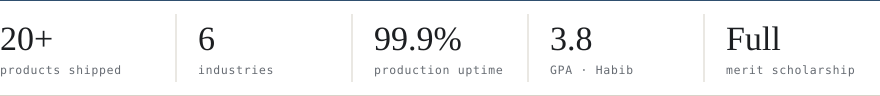

<picture>
  <source media="(prefers-color-scheme: dark)" srcset="assets/hero-dark.svg">
  
</picture>

I build AI products that keep working once real users show up. That means retrieval that cites its sources, agents that know when to hand off to a human, and inference costs that someone has already budgeted for.

**[Portfolio](https://areeshaamir.dev/)** · **[Resume](RESUME_URL)** · **[Email](mailto:EMAIL_ADDRESS)** · **[Book 20 min](CALENDAR_URL)** · **[LinkedIn](https://www.linkedin.com/in/areesha-amir/)**

<b>Currently</b> · shipping ‹current system, one line› · open to graduate scholarships, research, and production-AI roles

 

<picture>
  <source media="(prefers-color-scheme: dark)" srcset="assets/proof-dark.svg">
  
</picture>

 

## Selected systems

Each one has run with real users. Numbers come from production, not from benchmarks.

<table>
<tr>
<td width="50%" valign="top">
<b>01 · Grounded answers engine</b> 
RAG · ‹industry›  
<b>Problem</b>: Staff were answering policy questions from scattered documents, and a wrong answer had a real cost. 
<b>Built</b>: Hybrid retrieval (BM25 + dense) with reranking and sentence-level citations. It refuses to answer when the evidence is thin. 
<b>Outcome</b>: ‹__%› of answers carry a verifiable citation · p95 ‹__ s› · ‹__%› fewer escalations  
Python · FastAPI · pgvector · Claude / GPT · Docker  
<a href="LINK">Live</a> · <a href="LINK">Case study</a>
</td>
<td width="50%" valign="top">
<b>02 · Agentic operations workflow</b> 
Agents · ‹industry›  
<b>Problem</b>: A multi-step intake → lookup → update process was done by hand, hundreds of times a week. 
<b>Built</b>: A tool-calling agent with typed tools, step budgets, a full trace log, and human approval before anything is written. 
<b>Outcome</b>: ‹__ hrs/week› returned · ‹__%› resolved end-to-end · 0 unreviewed writes  
TypeScript · MCP · Postgres · queue workers  
<a href="LINK">Demo</a> · <a href="LINK">Architecture</a>
</td>
</tr>
<tr>
<td width="50%" valign="top">
<b>03 · Eval & regression harness</b> 
Reliability  
<b>Problem</b>: Prompt and model changes went out untested, and quality slipped without anyone noticing. 
<b>Built</b>: Golden sets, LLM-as-judge rubrics calibrated against human labels, and a CI gate on every prompt, model, or retrieval change. 
<b>Outcome</b>: ‹__› regressions caught before deploy · model swap at ‹__%› lower cost, same quality  
Python · pytest · LLM-as-judge · GitHub Actions  
<a href="LINK">Repo</a>
</td>
<td width="50%" valign="top">
<b>04 · Cost-aware LLM gateway</b> 
Infra  
<b>Problem</b>: Token spend was growing faster than usage. 
<b>Built</b>: Routing by task difficulty, semantic caching, streaming, provider fallbacks, and cost attribution per feature. 
<b>Outcome</b>: ‹__%› lower cost per request · 99.9% uptime through upstream provider outages  
FastAPI · Redis · OpenTelemetry · Docker  
<a href="LINK">Write-up</a>
</td>
</tr>
</table>

16 more across 6 industries at <a href="https://areeshaamir.dev/">areeshaamir.dev</a>.

## How I work

| Discover | Design | Build | Ship & sustain |
|:--|:--|:--|:--|
| Find the decision the system actually supports, and what a wrong answer costs. | Set latency, cost, and failure budgets before choosing a model. | Evals first, then the smallest pipeline that passes them. | Traces, alerts, and an escalation path, plus a person who owns it after launch. |

- **Measure before I optimize.** If I can't score a change, I don't ship it.
- **Design for failure.** Every model call has a timeout, a fallback, and a path to a human.
- **Cost is a feature.** Spend per request goes on the dashboard next to accuracy.
- **Boring where possible.** Postgres before a new database, a script before a framework.

## Stack

| Capability | What I use |
|:--|:--|
| **AI systems** | LLM APIs (Claude, GPT, open-weight) · RAG · reranking · structured output · evals · PyTorch |
| **Agents & automation** | Tool calling · MCP · planners with step budgets · human-in-the-loop · workflow queues |
| **Full-stack product** | TypeScript · React / Next.js · Python · FastAPI · PostgreSQL · auth & billing |
| **MLOps & infra** | Docker · CI/CD · OpenTelemetry · caching · vector stores (pgvector, FAISS) · cloud deploys |

## Signal

<picture>
  <source media="(prefers-color-scheme: dark)" srcset="https://github-readme-stats.vercel.app/api?username=AAreesha&count_private=true&include_all_commits=true&show_icons=true&hide_rank=true&hide_border=true&custom_title=GitHub&bg_color=0d1117&title_color=E8E4DC&text_color=8B9098&icon_color=86A7C8">
  
</picture>

<picture>
  <source media="(prefers-color-scheme: dark)" srcset="https://github-readme-activity-graph.vercel.app/graph?username=AAreesha&bg_color=0d1117&color=8B9098&title_color=E8E4DC&line=86A7C8&point=E8E4DC&area=true&area_color=86A7C8&hide_border=true&custom_title=Contribution%20activity&height=240">
  
</picture>

**Ask me about:** why your RAG demo hallucinates in production · evaluating agents without a labelled dataset · cutting inference cost without losing quality.

## Trajectory

**Habib University** · BS Computer Science · 2021–2025 
Full merit scholarship (HU TOPS) · 3.8 GPA · Dean's and President's Lists 
1st Runner-Up, IFTP at Texas A&M University (2024), on economic sustainability

The scholarship bought four years to learn the fundamentals properly. I spent them shipping: 20+ products across 6 industries, each one teaching me what fails first when real people use it. Now I'm looking for a place where production AI is the core problem, whether that's a research group, a graduate program, or a team that ships models to millions of users.

## Next step

If you fund, research, or ship AI systems that need to hold up in the real world, I'd like to hear from you. A short email is enough, and I reply within two days.

**[Email](mailto:EMAIL_ADDRESS)** · **[Book 20 min](CALENDAR_URL)** · **[areeshaamir.dev](https://areeshaamir.dev/)**
